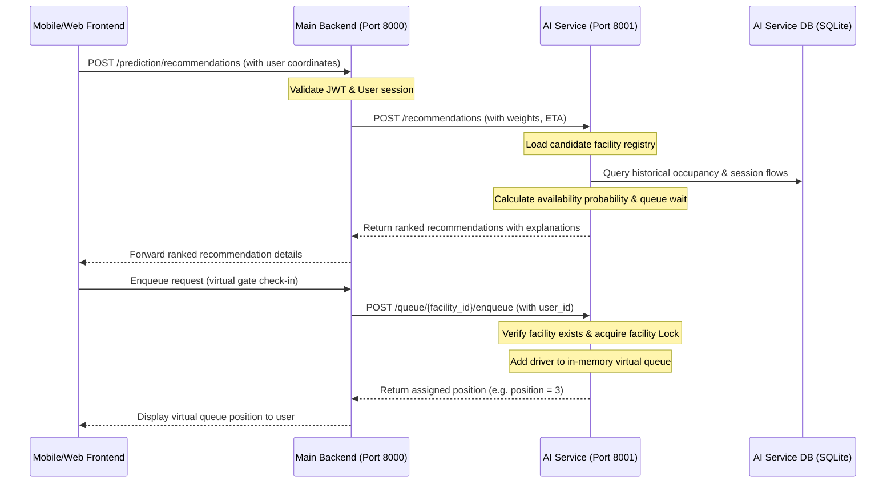

# ParkZenith AI Service Integration

This document outlines the architecture, responsibilities, communication flow, and security boundaries between the **ParkZenith Main Backend** and the **ParkZenith AI Service**.

---

## 1. Architectural Responsibilities

The system is split into two primary backend processes to separate operational transactions from analytical and machine learning workloads:

| Responsibility | Main Backend | AI Service |
| :--- | :--- | :--- |
| **Authentication & Authorization** | **Owner** (JWT Validation, Roles) | None (Internal service only) |
| **User & Facility Management** | **Owner** (Operational DB CRUD) | None (Read-only consumer) |
| **Realtime Bookings & Active Sessions** | **Owner** (WebSockets, Locks) | None (Read-only consumer) |
| **Data Collection & Resampling** | None | **Owner** (APScheduler Jobs) |
| **ML Model Training & Persistence** | None | **Owner** (Joblib packages, Regressors) |
| **Occupancy Forecasting & Availability** | None | **Owner** (Availability Engine, Predictions) |
| **Smart Candidate Recommendations** | None | **Owner** (Scoring, Explanation Engine) |
| **Virtual Gate Queue Management** | Client | **Owner** (In-memory Virtual Queue State) |

---

## 2. Component Ownership

### Database Ownership
- **Main Backend Database (`backend.db`)**: Holds critical transactional tables (`users`, `reservations`, `facilities`, etc.). 
- **AI Service Database (`ai_service.db`)**: Stores cleaned, resampled historical data (`occupancy_history`, `reservation_history`, `session_history`) ingested from the main backend.
- **Interaction**: The AI service queries the main backend endpoints periodically using `BackendAPIClient` to sync history logs into `ai_service.db`. The main backend does not access `ai_service.db` directly.

### ML Model Ownership
- The AI Service completely owns model training, persistence, and loading. 
- Models are persisted as unified joblib packages (`ai_service/models/occupancy_forecast.joblib`).
- Pre-trained default models (15, 30, and 60 minutes) are cached in memory as singletons. Custom horizon models are trained dynamically on demand and appended to the model package.

### Queue Ownership
- **Realtime Virtual Queue State**: Maintained inside the AI Service's `VirtualQueueManager` in a thread-safe, memory-based queue data structure.
- **Predictive Congestion Intelligence**: Calculated dynamically by the AI Service's `QueueEngine` combining active virtual queue lengths with historical arrival/departure flows.

---

## 3. Communication Flow

---

## 4. Failure Scenarios and Fault Tolerance

| Scenario | Impact | Controlled Mitigation / Response |
| :--- | :--- | :--- |
| **AI Service Down** | Main backend cannot predict or recommend | Main backend client catches `ConnectError`, returns HTTP 503 `AI_SERVICE_UNAVAILABLE` with a clean JSON error response (no stack trace leak). |
| **AI Service Timeout** | Delayed backend responses | Backend requests timeout after 10 seconds. Backend client catches `TimeoutException` and responds with HTTP 503 `AI_SERVICE_TIMEOUT`. |
| **ML Model Not Trained** | Forecasting & recommendations fail | AI Service raises `ModelUnavailableError` (HTTP 404). Backend client catches this and responds to frontend with HTTP 503 `MODEL_UNAVAILABLE` indicating model needs training. |
| **Insufficient Historical Logs** | Cannot predict occupancy | AI Service raises `InsufficientDataError` (HTTP 400). Response payload describes the issue clearly to help developer ingest seed data. |
| **Empty In-Memory Queue** | Dequeue request on empty gate | AI Service `VirtualQueueManager` handles gracefully, returns `success: false` and `user_id: null` instead of throwing an index error. |
| **Duplicate Enqueue** | User attempts to join queue twice | AI Service checks queue list, skips duplicate insertion, and returns their *current* queue position. |

---

## 5. Health Check and Readiness Strategy

### GET `/health`
- Indicates that the FastAPI service process is alive.
- Returns scheduler status (APScheduler state).
- Extremely lightweight (no DB or disk I/O).

### GET `/ready`
- Verifies that the service is fully prepared to handle traffic.
- Performs:
  1. **Database connectivity test** (executes `SELECT 1` on `ai_service.db`).
  2. **Model availability test** (verifies model package is successfully loaded in memory).
  3. **Scheduler status** check.
- Returns **HTTP 503 Service Unavailable** if database is unreachable or if ML models are not trained, warning orchestration tools not to route traffic here.
