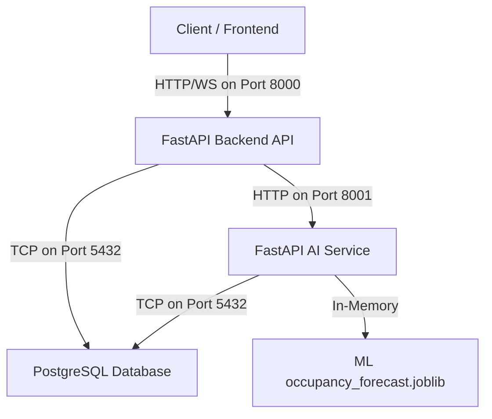

# ParkZenith Production Deployment Architecture

This document describes the production deployment architecture for the ParkZenith Smart Parking Management & AI Prediction System. The architecture is container-based and cloud-agnostic, supporting deployments on AWS, GCP, Azure, Render, Railway, or standard Docker hosts.

## Core Component Diagram

---

## Component Details

### 1. FastAPI Backend API (`backend`)
- **Docker Image**: `parkzenith-backend:latest`
- **Runtime**: Python 3.11-slim
- **Port**: `8000` (internal and host mapping)
- **ASGI Server**: Uvicorn running with 4 workers in production (no debug/reload)
- **Environment Variables**:
  - `ENVIRONMENT=production`
  - `LOG_LEVEL=INFO`
  - `DATABASE_URL=postgresql+asyncpg://parkzenith_user:parkzenith_secure_password_987@db:5432/parkzenith`
  - `SECRET_KEY` (Strong secret key for JWT session tokens)
  - `ALGORITHM=HS256`
  - `ACCESS_TOKEN_EXPIRE_MINUTES=60`
  - `AI_SERVICE_URL=http://ai-service:8001`
  - `AI_SERVICE_TIMEOUT=10.0`
  - `AI_SERVICE_ENABLED=True`
  - `ALLOWED_ORIGINS` (Configured production CORS domains, wildcard `*` is disabled)
- **Health Checks**:
  - Endpoint: `/health` (checks if the app process is alive)
  - Endpoint: `/ready` (verifies connectivity to PostgreSQL and AI-service)
- **Persistent Storage**: None required.
- **Dependencies**: Depends on `ai-service` and `db` to be fully healthy.

### 2. FastAPI AI Service (`ai-service`)
- **Docker Image**: `parkzenith-ai-service:latest`
- **Runtime**: Python 3.11-slim (with scikit-learn, pandas, numpy)
- **Port**: `8001` (internal mapping)
- **ASGI Server**: Uvicorn production server
- **Environment Variables**:
  - `ENVIRONMENT=production`
  - `LOG_LEVEL=INFO`
  - `DATABASE_URL=postgresql+asyncpg://parkzenith_user:parkzenith_secure_password_987@db:5432/parkzenith`
  - `BACKEND_API_URL=http://backend:8000/api/v1`
  - `BACKEND_API_KEY` (Secure auth key for inter-service communication validation)
  - `HTTP_TIMEOUT_SECONDS=10.0`
  - `EXPORT_PATH=/app/ai_service/datasets`
- **Model Loading**:
  - Pre-trained ML occupancy forecasting models (`occupancy_forecast.joblib`) are embedded in `/app/ai_service/models/` and loaded into memory on application startup.
- **Health Checks**:
  - Endpoint: `/health` (checks process and background APScheduler status)
  - Endpoint: `/ready` (checks connection to database and ML model readiness)
- **Persistent Storage**:
  - A persistent volume `ai-service-data` is mounted to `/app/ai_service/datasets` for export files.
- **Dependencies**: Depends on `db` to be fully healthy.

### 3. PostgreSQL Database (`db`)
- **Docker Image**: `postgres:15-alpine`
- **Port**: `5432`
- **Authentication**:
  - `POSTGRES_USER=parkzenith_user`
  - `POSTGRES_PASSWORD=parkzenith_secure_password_987`
  - `POSTGRES_DB=parkzenith`
- **Health Check**:
  - command: `pg_isready -U parkzenith_user -d parkzenith`
- **Persistent Storage**:
  - A persistent volume `postgres-data` mapped to `/var/lib/postgresql/data`.

---

## Network Communication & Security
- **Isolation**: Containers communicate via a shared internal Docker network overlay.
- **Access Restrictions**: Only the Backend service port `8000` is exposed to public client requests. The database and AI service ports are restricted to internal container network traffic.
- **Secrets Management**: Secrets (JWT secret keys, passwords, API tokens) must be injected into containers using standard container runtimes, Kubernetes Secrets, or a secure `.env` file, and never hardcoded in Dockerfiles.
