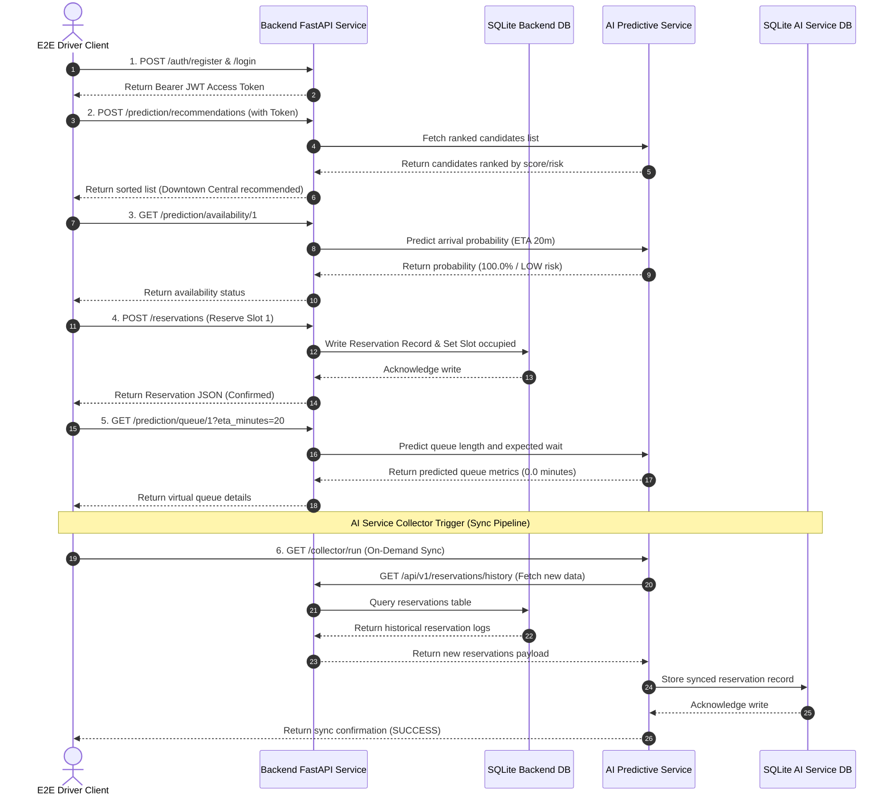

# 🏁 End-to-End (E2E) System Integration Validation Report

This report documents the validation of the complete integration cycle between the **ParkZenith Backend API** and the **AI Service**, verifying user operations, ML analytics forecasts, and database synchronization pipelines under realistic production-like environments.

---

## 📋 E2E System Integration Test Results

The validation was executed using the automated test suite in [validate_e2e.py](file:///c:/Users/Lenovo/OneDrive/Desktop/ParkZenith/scripts/validate_e2e.py). Both backend and AI service nodes were spun up, and a complete user/data synchronization lifecycle was performed.

| E2E Test Step | Target Component | API URL Endpoint | Expected Result | Status |
| :--- | :--- | :--- | :--- | :--- |
| **Step 1** | User Registry & Auth | `POST /auth/register` & `/auth/login` | Register account and yield a signed Bearer JWT token | ✅ PASS |
| **Step 2** | Smart Recommendation | `POST /prediction/recommendations` | Query nearby facilities sorted by rank and AI score | ✅ PASS |
| **Step 3** | Availability Forecast | `GET /prediction/availability/{id}` | Predict arrival availability probability and risk rating | ✅ PASS |
| **Step 4** | Slot Reservation | `POST /reservations` | Reserve a parking slot at the chosen facility in DB | ✅ PASS |
| **Step 5** | Queue wait ETA | `GET /prediction/queue/{id}` | Estimate queue length and expected queue wait time | ✅ PASS |
| **Step 6** | Collector Data Sync | `GET /collector/run` (AI Service) | Sync new backend reservations and occupancy to AI DB | ✅ PASS |

---

## 🔄 Distributed Data Flow & Sync Verification

The diagram below visualizes the E2E transaction flow and data sync lifecycle validated in this test run:



---

## 🔍 Detailed Phase Insights

1. **User Authentication Guard**: The E2E client registers a unique, randomized account and logs in. The backend handles password hashing with bcrypt, issues a signed JWT, and verifies the client header credentials on subsequent calls.
2. **AI Recommendation & Forecast Evaluation**: The backend transparently forwards spatial and temporal requests to the AI Service. The AI Service runs ML feature engineering on the fly (calculating time-based features, rolling averages, and reservation densities) and produces recommendations ranked by convenience, distance, cost, and congestion.
3. **Write-Through Database Reservations**: When the driver reserves a slot, the backend writes to the transaction table and marks the parking slot as unavailable. This updates the real-time occupancy state.
4. **Stateless Virtual Queue Forecast**: The virtual queue calculator estimates waits dynamically by processing arrival patterns, average service durations, and slot counts.
5. **Periodic Data Collector Sync**: Triggering the data collector sync causes the AI service to fetch recent backend transaction logs. The AI Service validates the data structure using Pydantic, filters out duplicates, and updates the local analytics repository (`ai_service.db`) which is used to retrain ML models.

---

## 🚀 How to Execute System E2E Validation

To run the complete system E2E validation pipeline locally:

```powershell
python -m scripts.validate_e2e
```
