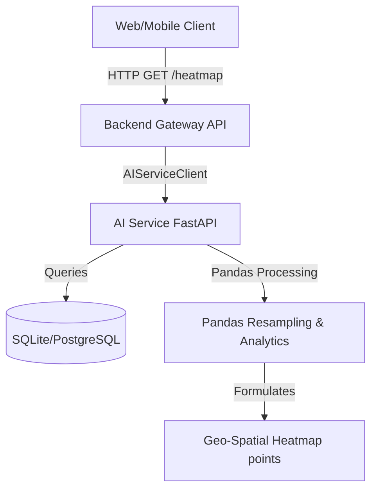

# ParkZenith AI Heatmap Intelligence Module

This document outlines the architecture, calculations, data flows, API specifications, and example payloads of the AI Heatmap Intelligence module.

---

## 1. System Architecture

The AI Heatmap Intelligence module provides spatial-temporal density mapping and congestion metrics of parking facilities and individual zones. The backend acts as a gateway proxying client requests to the AI Service.



### Key Components
1. **Heatmap Calculations Layer**: Functional helpers calculating density, utilization, congestion indexes, and mapping them to color intensities (0–100).
2. **Heatmap Intelligence Service**: The orchestrator query-mapping SQL records, generating dynamic zone coordinates, resampling historical databases, and formulating AI analytics.
3. **FastAPI Routes**: REST entry points on both the AI Service (`/heatmap/...`) and the Backend (`/api/v1/heatmap/...`).

---

## 2. Core Calculations & Formulas

- **Occupancy Percentage**:
  $$\text{occupancy} = \frac{\text{occupied\_slots}}{\text{total\_slots}} \times 100.0$$
- **Density Score**: Represents the occupancy density of the area. Under basic conditions, $\text{density} = \text{occupancy}$.
- **Congestion Index**: Combines slot occupancy and virtual queue penalties to form a score from 0.0 to 100.0.
  $$\text{congestion\_index} = \text{occupancy\_percentage} \times 0.8 + \min(20.0, \text{queue\_length} \times 2.0 + \text{waiting\_time\_minutes} \times 0.5)$$
- **Color Intensity Score (0–100)**: Linearly maps the density score to visual transparency/opacity weights for rendering on maps.
  $$\text{intensity} = \min(100.0, \max(0.0, \text{density\_score}))$$

---

## 3. API Contract & Endpoints

### 3.1 GET `/heatmap/live`
Retrieves live overall density and zone breakdowns for all active facilities.

* **Response Model**: `LiveHeatmap`
* **Response Payload Example**:
```json
{
  "timestamp": "2026-08-06T11:00:00Z",
  "facilities": [
    {
      "facility_id": "1",
      "facility_name": "Downtown Central Parking",
      "latitude": 12.9716,
      "longitude": 77.5946,
      "overall_density": 80.0,
      "overall_congestion_score": {
        "congestion_index": 64.0,
        "congestion_level": "MODERATE",
        "capacity_utilization": 80.0,
        "zone_utilization": 80.0
      },
      "points": [
        {
          "latitude": 12.97205,
          "longitude": 77.59505,
          "intensity": 80.0,
          "zone_id": "ZONE-A",
          "facility_id": "1"
        },
        {
          "latitude": 12.9716,
          "longitude": 77.5946,
          "intensity": 80.0,
          "zone_id": null,
          "facility_id": "1"
        }
      ],
      "zones": [
        {
          "zone_id": "ZONE-A",
          "density_score": 80.0,
          "occupancy_percentage": 80.0,
          "occupied_slots": 40,
          "total_slots": 50,
          "intensity": 80.0
        }
      ]
    }
  ]
}
```

### 3.2 GET `/heatmap/history`
Retrieves aggregated historical heatmap trends.
* **Parameters**:
  - `start_date` (datetime, optional)
  - `end_date` (datetime, optional)
  - `interval` (string: hourly, daily, weekly, monthly)
  - `facility_id` (string, optional)
* **Response Model**: `HistoricalHeatmap`

### 3.3 GET `/heatmap/zones`
Retrieves AI analytics, peak times, and summaries of parking zones.
* **Response Model**: `ZoneAnalyticsResponse`
* **Response Payload Example**:
```json
{
  "most_congested_zones": ["ZONE-A"],
  "least_occupied_zones": ["ZONE-B"],
  "average_density": 65.5,
  "peak_congestion_periods": [
    {
      "period": "14:00 - 15:00",
      "density": 85.0
    }
  ],
  "heatmap_summaries": {
    "most_congested": "Zone 'ZONE-A' exhibits peak occupancy density, averaging 85.0% utilization.",
    "least_occupied": "Zone 'ZONE-B' has the highest vacancy availability, averaging 40.0% free slots.",
    "general_status": "The average spatial density across parking zones is 65.5% with peak traffic congestion occurring around 14:00 - 15:00."
  },
  "zones": [
    {
      "zone_id": "ZONE-A",
      "density_score": 85.0,
      "occupancy_percentage": 85.0,
      "occupied_slots": 42,
      "total_slots": 50,
      "intensity": 85.0
    }
  ]
}
```

### 3.4 GET `/heatmap/facility/{facility_id}`
Returns details for a single facility.
* **Response Model**: `FacilityHeatmap`
